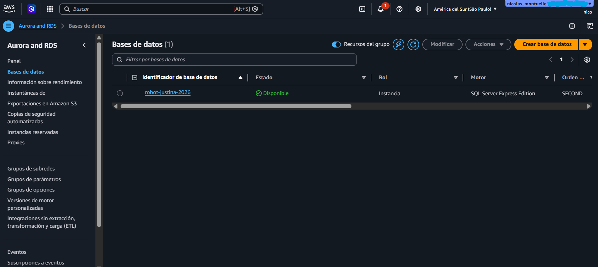
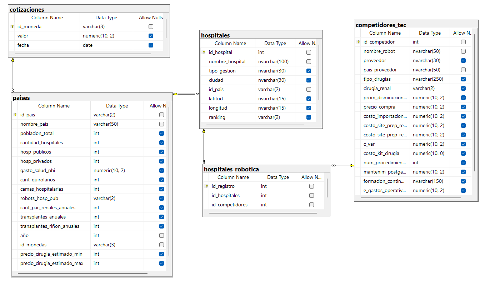
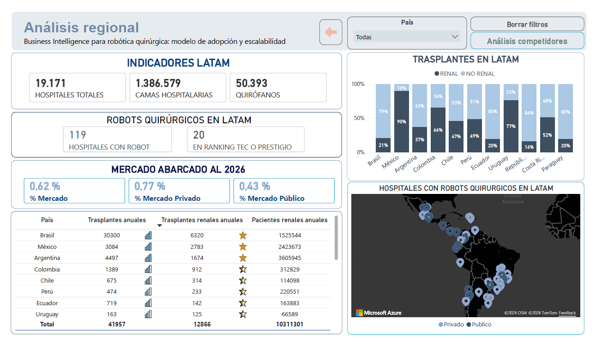
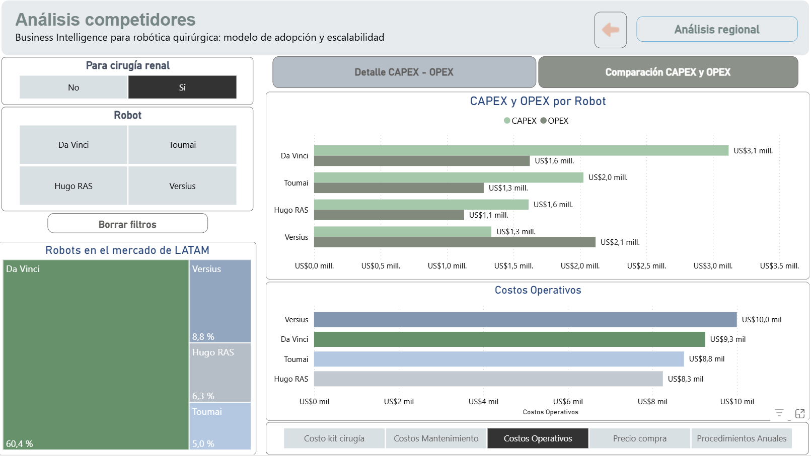

# 🏥 Business Intelligence para Robótica Quirúrgica – Proyecto Justina

---

# 📊 Proyecto de análisis estratégico para tecnología médica

Este proyecto desarrolla un **modelo de Business Intelligence aplicado al mercado de robótica quirúrgica en Latinoamérica**, con el objetivo de evaluar la **viabilidad económica y estratégica del robot quirúrgico Justina**.

Se construyó un **pipeline de datos completo**, desde la recolección de información pública y benchmarks del sector hasta el modelado y visualización en dashboards interactivos.

---

# 🚨 El Problema

La **robótica quirúrgica ofrece enormes beneficios clínicos**, pero su adopción en Latinoamérica sigue siendo limitada.

Las principales barreras son:

- 💰 **Altos costos de adquisición**
- 📉 **Falta de modelos económicos claros**
- 🏥 **Dificultad para justificar la inversión hospitalaria**
- 📊 **Ausencia de análisis de mercado estructurado**

Esto genera un problema crítico:

> Los hospitales y desarrolladores de tecnología médica **no cuentan con información estratégica suficiente para tomar decisiones informadas sobre la adopción de cirugía robótica.**

Este proyecto busca **resolver ese vacío mediante análisis de datos y Business Intelligence**.

---

# 🎯 Objetivo del Proyecto

Construir un **modelo analítico que permita evaluar la adopción de robótica quirúrgica en Latinoamérica**, considerando:

- Mercado potencial (**TAM / SAM / SOM**)
- Costos de tecnología médica (**CAPEX / OPEX / TCO**)
- Competidores tecnológicos
- Capacidad hospitalaria regional
- Demanda potencial de cirugías renales

El resultado es un **sistema de análisis orientado a decisiones estratégicas e inversión en healthtech**.

---

# 🛠 Mi Contribución Técnica

En este proyecto grupal, asumí el rol de **Data Engineer & Data Analyst**, encargándome de la infraestructura de datos y la automatización del pipeline. Mis aportes principales fueron:

### 🐍 Desarrollo en Python e Integración de IA
* **Automatización de Extracción:** Desarrollé scripts en Python para la ingesta de datos, integrando modelos de lenguaje (IA) para procesar y estructurar información.
* **Optimizacion de Tiempos:** La implementación de IA en el pipeline permitió reducir drásticamente los tiempos de procesamiento y limpieza, acelerando la disponibilidad de los datos para el equipo de análisis.
* **Lógica de Negocio:** Implementé en el código la lógica para la normalización de variables críticas, asegurando que los datos de entrada fueran compatibles con el modelo relacional.

### 🗄️ Arquitectura SQL Server y Despliegue en AWS RDS
* **Modelado de Datos:** Diseñé y ejecuté el esquema relacional en SQL Server, optimizando las entidades para el consumo de BI.
* **Infraestructura Cloud:** Implementeé el despliegue de la base de datos en **AWS RDS (Relational Database Service)**, permitiendo que el equipo tuviera una fuente de verdad única, escalable y accesible de forma remota para el dashboard de Power BI.
* **Eficiencia en Costos:** Configuré AWS Instance Scheduler para automatizar el encendido y apagado de la base de datos según los horarios de trabajo del equipo, logrando una optimización significativa de los costos operativos del proyecto en la nube.

> **Visualización de la Infraestructura en AWS:**
>  
> *(Referencia de la instancia de base de datos activa en la nube)*

### 🔍 Calidad de Datos (Data Quality)
* **Verificación Manual:** Realicé auditorías manuales de fuentes de datos primarias para garantizar la veracidad y calidad de los datos, eliminando sesgos o datos erróneo causados por la IA antes de la carga masiva.
* **Validación de Fuentes:** Aseguré que la recolección de información pública cumpliera con los estándares necesarios para un análisis de viabilidad económica real.

---

## 📚 Documentación del Proyecto

En este apartado se encuentra el informe completo del proyecto, donde se detalla el análisis realizado, la metodología utilizada y las conclusiones obtenidas.

📄 **Descargar o visualizar el informe completo:**  
[Informe del Proyecto (PDF)](https://github.com/No-Country-simulation/S02-26-Equipo-63-BI/blob/main/informes_proyecto_pdf/Business%20Intelligence%20para%20rob%C3%B3tica%20quir%C3%BArgica%20Justina%20-%20E63.pdf)

---
# 🧰 Tecnologías Utilizadas

**Stack del proyecto**

- 🐍 Python  
- 🗄 SQL Server  
- 📊 Power BI  
- ☁ AWS  
- 📋 Excel / Google Sheets  
- 🧠 IA (GPT, Gemini, Perplexity, Qwen)

---

# 🗄 Modelo de Datos

El proyecto se basa en un **modelo relacional orientado al análisis del ecosistema de cirugía robótica en LATAM**.

Principales entidades:

- Países
- Hospitales
- Competidores tecnológicos
- Relación hospitales–robots
- Cotizaciones

### 📷 Ver modelo SQL

- Para el funcionamiento del código python de este repositorio se deben reemplazar variables por credenciales confidenciales
- Los API de Gemini también son confidenciales
  
---

# 📊 Dashboard de Business Intelligence

El análisis final se presenta mediante un **dashboard interactivo en Power BI**, donde se pueden explorar:

- Distribución de robots quirúrgicos en LATAM  
- Hospitales que adoptaron tecnología robótica  
- Análisis de costos de adquisición  
- Comparación entre competidores  
- Estimación del mercado potencial  

### 🔎 Ver reporte completo

👉 **[Descargar Reporte en pdf](informes_proyecto_pdf/Reporte_BI_Justina.pdf)**

---

# 🚀 Explorar el Informe Interactivo

El valor principal del proyecto está en la **exploración interactiva de los datos**.

📊 Navegá el análisis completo aquí:

# 👉 **[Entrar al informe de Business Intelligence](https://app.powerbi.com/view?r=eyJrIjoiZjdjMWYyYzktZjRmZi00N2I4LTlmNzktMjJhNzI3ODFmZjk2IiwidCI6Ijc3MDI2YzQzLTFmNWMtNDEyYy1iNjg1LTJkNTM4Y2Q4NWIzMCIsImMiOjR9)**

Descubrí:

- insights sobre el mercado de robótica quirúrgica  
- oportunidades para nuevas tecnologías médicas  
- análisis económico del sector healthtech  

---

# 💡 Insights del Proyecto

El análisis permite:

- Detectar **oportunidades de adopción de robótica quirúrgica en LATAM**
- Evaluar **costos reales de implementación hospitalaria**
- Comparar **tecnologías competidoras**
- Generar **información estratégica para inversores y desarrolladores**

Este enfoque permite transformar **datos dispersos en decisiones estratégicas basadas en evidencia**.

---

# 👨‍💻 Contexto del Proyecto

Proyecto realizado en el marco de:

**Simulación laboral – No Country Febrero 2026**  
Área: **Data Analysis / Business Intelligence / HealthTech**

---

⭐ Si te interesa el análisis de datos aplicado a **salud, tecnología médica y estrategia**, te invito a explorar el dashboard completo.

---

## 👥 Integrantes

- **Nicolas Montuelle**  
  

- **Priscila Gutierrez Sídoli**  
  

- **Camila Ayelen Durand**  
  

- **Rubis Becerra**  
  

---

## ⭐ Si te resultó interesante el proyecto

Considerá darle **⭐ al repositorio** para apoyar el trabajo.
